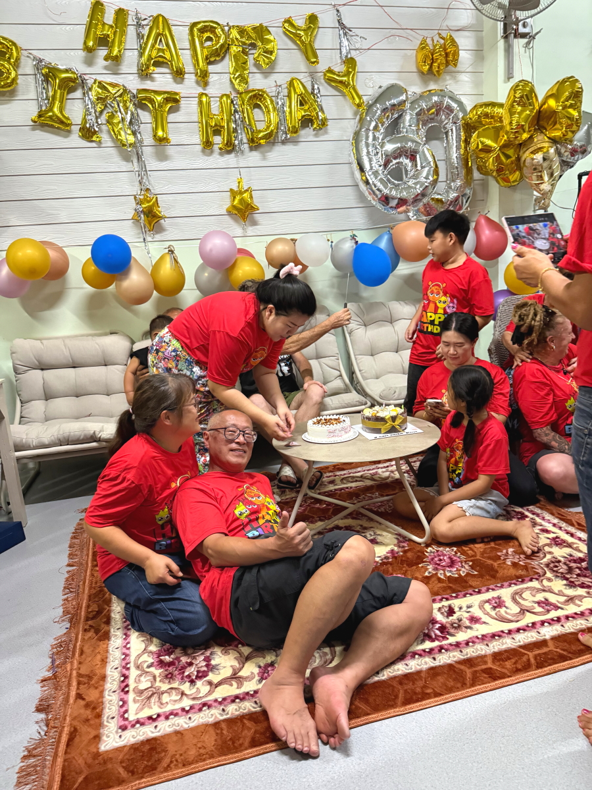
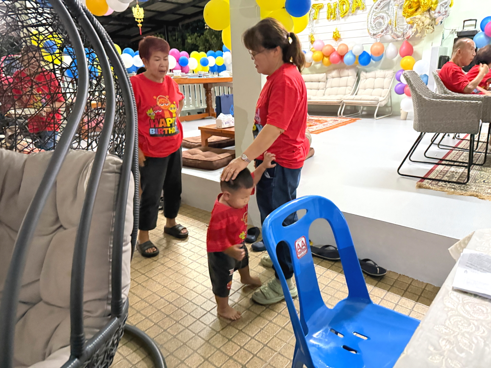

# 20250927_maechan

<html lang="ja" data-loaded="false" data-scrolled="false" data-spmenu="closed">
<head>

<meta charset="UTF-8">
<meta http-equiv="Content-Type" content="text/html; charset=UTF-8">
<meta http-equiv="X-UA-Compatible" content="IE=EmulateIE10" />
<meta http-equiv="X-UA-Compatible" content="IE=edge">

<meta name="viewport" content="width=device-width, initial-scale=1.0">

<!--ここから上はお決まりの定型文です-->

<!--ここからが表現の書式などを決めるcssという部分-->

<link href="https://cdnjs.cloudflare.com/ajax/libs/lightbox2/2.7.1/css/lightbox.css" rel="stylesheet">

</head>

<body>
<h2>
Happy Birthday><a href="https://torokoid.github.io/20250927__maechan/">Polis's Home</a>
</h2>

<!--

モバイル端末をお使いの場合は、画面を横向きにすると
背景画像の横方向がご覧頂けます。

-->

<!--ここ上は、ほぼそのまま使います！-->

<!--QRコードの挿入例-->

 QR for Access

<marquee direction="left" scrollamount="20" width="30%">(^_^)/~Hada</marquee>

<!--流れ文字の挿入例-->
<h1><marquee behavior="left">!!! 2568(2025)/09/26、Happy Birthday Dinner !!!</marquee></h1>

                          

<!--ここから下が、本体部分-->
    

 
<h2>26Sep2568、Happy Birthday Dinner</h2>

    

<iframe width="560" height="315" src="https://www.youtube.com/embed/SoP6mxojYVc?si=A0MlfLSTn_WqNIzJ" title="YouTube video player" frameborder="0" allow="accelerometer; autoplay; clipboard-write; encrypted-media; gyroscope; picture-in-picture; web-share" referrerpolicy="strict-origin-when-cross-origin" allowfullscreen></iframe>
    

    

    

<iframe width="560" height="315" src="https://www.youtube.com/embed/un51lZfIm9o?si=rTMZOjuprJCYSupd" title="YouTube video player" frameborder="0" allow="accelerometer; autoplay; clipboard-write; encrypted-media; gyroscope; picture-in-picture; web-share" referrerpolicy="strict-origin-when-cross-origin" allowfullscreen></iframe>
    

    

<h2>Click on the image to play the video ↓</h2>

    
<h2>Click on the image to play the video ↓</h2>

         

   
<h2>Happy Birthday Dinner Thank you for reading this far.</h2>

    

   

<!-- hitwebcounter Code START -->
<a href="https://www.hitwebcounter.com" target="_blank">

you are visitor The numbers are cumulative for the Bangkok series websites launched since August 1st.
</a>   

         

  

      

<!--本体はここまで-->

<!--画面に空白地帯を作って、背景が見えるようにしています-->
                                              

<!-- フッタ -->
<footer>

Copyright 2025/09/27 Hada @Mae Chan

</footer>

<!--HPにさまざまなJavaScriptを呼び込むための書式-->

    
    </body>
    
</html>

